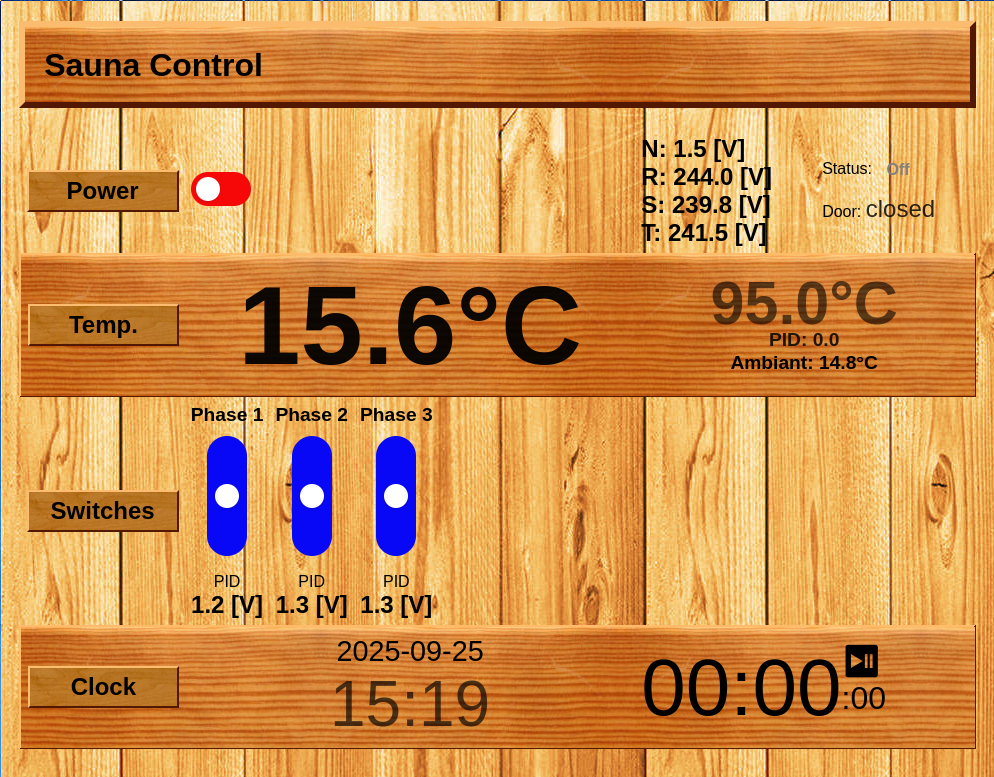

Generally, a **finite state machine** that runs on ESP microcontrollers.

Control a sauna with ESP8266, PID (1-wire Dallas temperature sensors), web server.

Interface makes it easy to program temperature profiles (on another host, over
HTTP), so *sauna* can also be an oven, a drying rig, refrigeration unit, or any
other similar climate-controled device. Focus is on clean and versatile code.



# Features

* PID-based temperature control
* remotely enable/disable device
* remotely set temperature target
* low-latency UI updates (websocket) ; works well with multiple clients
* CLI prototype (python) for easy scripting
* independant phase control, code mostly supports configurable number of outputs
* staged proportional heating (SSR on slow PWM) or (slower still) staged control of electromechanical relays
* door switch support and client-side timer (with auto-start)
* optional [PS-VM-RD](https://electro.nimag.net/PS-VM-RD/) integration (voltage measure)
* ESP starts in AP mode if SSID is not configured, or if connection to configured SSID fails after configured timeout

## TODO

In no particular order...

* HTTPS on ESP32
* RGB lighting (connect to WLED host?)
* ice bath
* Timing bell and deadman's switch
* Max power setting for controlled temperature slopes
* some sort of authentication mechanism
* HTML form to set parameters
* make HTML (and js and css) support configured number of relays
* temperature graph in HTML UI (host-side temperature history)
* TRIAC output
* PS-VM-RD temperature and relays
* bar-graph style power output for SSR and TRIAC widgets
* autocloud integration

A few more TODOs reside in the code ; just grep it.


# Safety note

It is advised to use a certified, external protection such as the [Danfoss KP85
(060L125666)](https://store.danfoss.com/us/en_US/Sensing-solutions/Switches/Temperature-switches/KP/Thermostat%2C-KP85/p/060L125666)
thermostat: trip point set slightly above the max operating temperature, **NO
SELF RESET / MANUAL RESET ONLY**.

In any case, the author does not endorse **ANY** responsibility in case of
malfunction, fire, injury or whatsoever : **YOU ARE ON YOUR OWN**, and **NEVER
LEAVE A POWERED DEVICE UNATTENDED**.

# Hardware Stuff

## Pin assignments:
This is valid for ESP8266 ; for more advanced features (ie. PS-VM-RD support, ESP32 is recommended)

```
ESP   label       PS-VM-RD
--------------------------
D0    WS2812_Din   -
D1    OneWire      - // temperature sensors
D2    RAON        7
D3    RELAY1       -
D4    DOOR_SW      -
D5    SCLK        15
D6    (MISO) SDO  14
D7    (MOSI) SDI  13
D8    (CS) LATCH  16
RX    RELAY2       -
TX    RELAY3       -
A0    AOUTA       12 // for PS-VM-RD
```

# Software Stuff

## Compile, upload and monitor

Copy `src/network.h.example` and save your changes in `src/network.h`. Check configuration options in `src/main.cpp`. Then:

```sh
pio run --target uploadfs
pio run --target upload
pio device monitor
```

## Remote operation

### Enable

`curl http://<ip>/enable`

### Disable

`curl http://<ip>/disable`

### Set temperature

`curl http://<ip>/set?target=<float temperature>`

